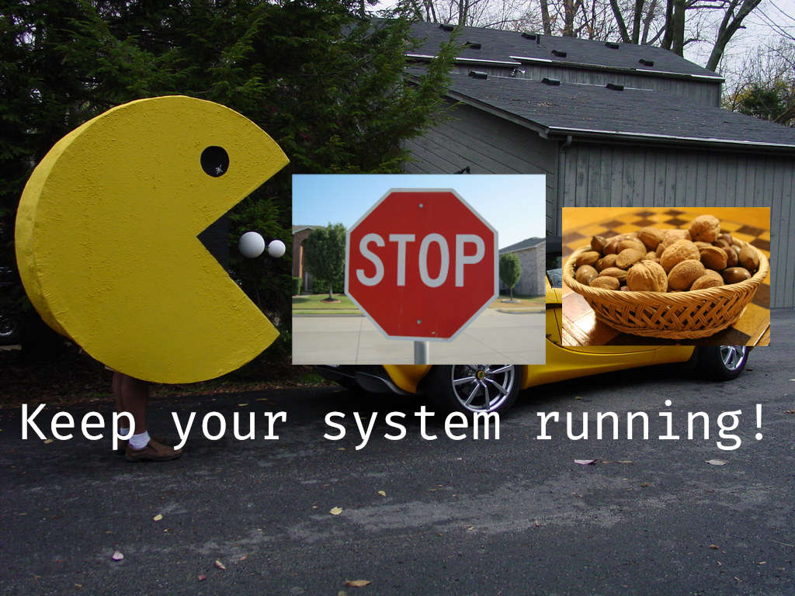

Summary - change the line in /etc/pacman.conf from

```
NoUpgrade   =
```

to

```
NoUpgrade   = usr/lib/modules/*
```

This is will prevent upgrades from overriding any kernels modules residing
in `/usr/lib/modules` (make sure to not include the leading `/` in
`/usr/lib/modules`  as specified in the pacman.conf documentation). Your
system will now continue to function properly and load device drivers. You
should still reboot your system when possible however, to get the latest
kernel and modules.

The catch is that you will need to manually clean up old kernel modules,
which honestly, is not a big deal. You can make a script to remove old
modules, or even in a pacman post-hook (look at man alpm-hooks).

Here's a script I made that works well for me

```bash
#!/bin/bash
# mod_clean_arch.sh

# A script to clean up old kernel modules (not current kernel and not
# newly installed) in the /usr/lib/modules directory. Necessary as I
# want to be able to continue using the PC after a kernel update

# Install in /etc/pacman.d/scripts
# Call from a alpm path post-hook at /etc/pacman.d/hooks

set -e

CURRENT_KERN="$(uname -r)"
# LINUX and LINUX_LTS actually do not give exactly the correct values,
# the pacman version is eg. 5.10.3.arch1-1, but the module directory
# name is 5.10.3-arch1-1. In a regular expression with grep this is
# fine, because a dot globs every character, but it will not work with
# the `ls` --hide option unless you process the version to change the
# '.' to a '-', which is not worth it
LINUX="$(pacman -Qi linux | awk '/Version/ { print $3 }')"
LINUX_LTS="$(pacman -Qi linux-lts | awk '/Version/ { print $3 "-lts" }')"
OLD_MODULES="$(ls /usr/lib/modules | grep -e "$LINUX" -e "$LINUX_LTS" -e "$CURRENT_KERN" --invert-match)"

cd /usr/lib/modules
echo "==> Current working directory: $(pwd)"
echo "==> Removing old kernel modules..."
for MODULE in $OLD_MODULES; do
    echo "==> Deleting $(pwd)/$MODULE"
    sudo rm -rf "$MODULE"
done
```

The script

1. Finds the current kernel, and the currently installed kernels
2. Removes all modules that are not the currently installed or in use
   kernels

Pretty easy. I use `linux` and `linux-lts` hence the variables, if you only
use one, just comment out lts or linux. If you need `linux-hardened` or
`linux-zen`, add the appropriate variables and modify old modules as
necessary.

The hook I use installed in `/etc/pacman.d/hooks` looks like this (
99-kern-modules-clean.hook)

```ini
[Trigger]
Operation = Upgrade
Operation = Remove
Operation = Install
Type = Path
Target = usr/lib/modules/*/

[Action]
Description = Cleaning up old kernel modules
When = PostTransaction
Exec = /etc/pacman.d/scripts/mod_clean_arch.sh
```

Make sure to install the script into `/etc/pacman.d/scripts`, and the hook
into `/etc/pacman.d/hook` if you want to do this. Alternatively, just call
the mod clean script manually when you need to clean.

The benefits of not having to close dozens of browser tabs, your code
editor and all your terminals carefully arranged in different work spaces
in an event where you need to plug in a mouse, keyboard or HDMI for a
presentation is tremendous in my opinion. It also allows you to install new
packages with `pacman -Syu` without worry of having to restart immediately.

## What led to this

After months on and off trying to solve this issue, I found a simple
solution to keep your computer and its device drivers functional after a
kernel upgrade!

So I discovered this issue in 2020 when someone gave me one of his spare
mice. He is a electrical, cloud database infrastructure engineer who works
more on the hardware side of things than the software. He knew about Linux,
but never tried it, and was interested to see if the drivers would plug and
play like was promised. I plugged it in and lo and behold, it wasn't
working. I checked `lsusb` which saw the USB device, and dmesg which also
registered it; but nevertheless I was dumbfounded to discover it would not
work.

'I guess Linux does not have the device drivers for this mouse', he said.

Oh the shame! I had been preaching almost on the simplicity and reliability
of Linux, but was let down by my own lack of knowledge. I was dumbfounded,
and proceeded to test another wireless mouse I had, which also did not
work. This was odd, because the mouse had worked just a day earlier. So I
did what all computer professionals do when reach this kind of roadblock, I
rebooted the system.

And it worked: `dmesg -w` showed the device as well as the driver being
loaded. Why? Because I discovered that Linux kernels don't generally 'live
update' like I thought they did. The kernel you boot with resides in RAM,
and can't easily be changed through an update, as it is the essential core
of your system. The kernel modules as well, must be built specifically for
a kernel version, due to the variation in kernel options and static and
non-static modules included in the kernel configuration.

So when `pacman` upgrades the `linux` or `linux-lts` package, it upgrades
the non-static kernel modules located in `/usr/lib/modules`. These new
modules are built against the new kernel version, and are not compatible
with the kernel that is still running in your RAM, which you can see with
`uname -r`.  Hence the system is unable to load the non-static modules
required for mouse and keyboard, unless those drivers are already built
statically in the kernel.

## This is a big issue! What should I do?

This is certainly something I asked for a while. When I looked online for
helped, all I could find was a Reddit post from 4 years ago that attempts
to solve the issue.

<https://www.reddit.com/r/archlinux/comments/4zrsc3/keep_your_system_fully_functional_after_a_kernel/>

But having tested it for months, it is a flawed and fairly complicated
solution. What it aimed to do was:

1. Copy the current modules into a backup in a pre-hook

2. Upgrade the system

3. Relink the backup modules back to the original folder in a post-hook

I found this worked 70% of the time, and I am still not sure why, other
than the clumsiness of writing out the Exec = statement in the hook file,
it seemed the pre-hook just didn't like to run sometimes.

Nevertheless, I was convinced there must have been an easier solution, and
set out to find which script on the system removes the current kernel
modules. But I hit a roadblock, and as a temporary solution, moved to LTS
kernel and updated once a week, or once a month, which meant I did not need
to reboot as often, but is not ideal security-wise.

And that's where today, the 6th of Feb 2021, I was irked enough to take a
second dive into the issue. I realised this time that it was not a script
deleting the old modules, but the package manager itself, in a normal
upgrade configuration. That's when it hit me! If this is a package manager
issue, then there should be a configuration option I can change to prevent
the current module from being deleted. Lo and behold, I found it in `man
pacman.conf`

```man
NoUpgrade = file ...
           All files listed with a NoUpgrade directive will never
           be touched during a package install/upgrade, and the
           new files will be installed with a .pacnew extension.
           These files refer to files in the package archive, so
           do not include the leading slash (the RootDir) when
           specifying them. Shell-style glob patterns are allowed.
           It is possible to invert matches by prepending a file
           with an exclamation mark. Inverted files will result in
           previously blacklisted files being whitelisted again.
           Subsequent matches will override previous ones. A
           leading literal exclamation mark or backslash needs to
           be escaped.
```

So I changed

```
#NoUpgrade   =
```

to

```
NoUpgrade   = usr/lib/modules/*
```

and downgraded kernels several times to test. Each time, their old kernel
modules remained; success! Who knew it would be so easy!

On upgrade, things work smoothly as expected, just by changing one line of
a built-in configuration option.

I hope this has helped you some, maybe next article I will see if I can
write a script to clean up old modules. All the best and good luck!

P.S I have, it should be included in the summary 🙂
