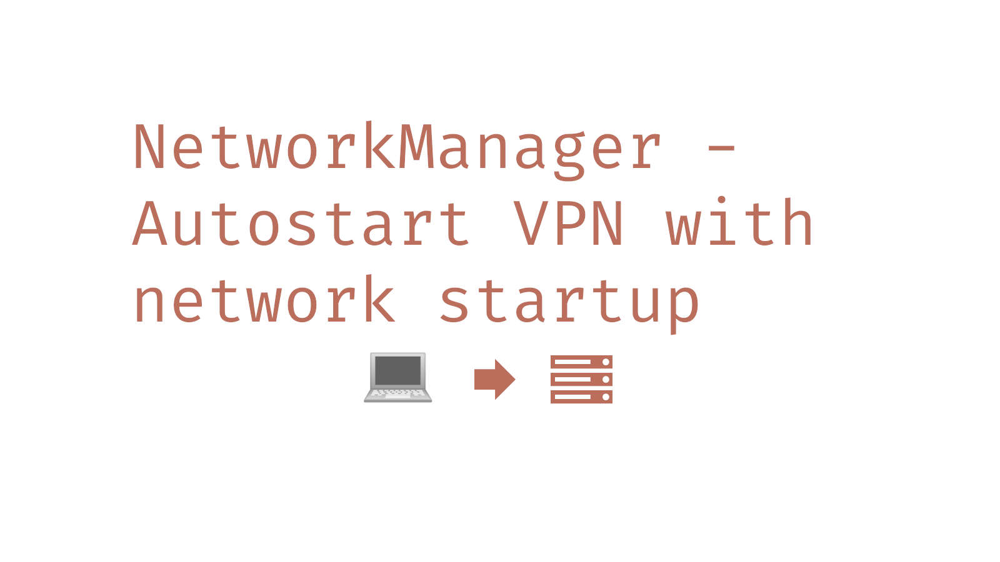
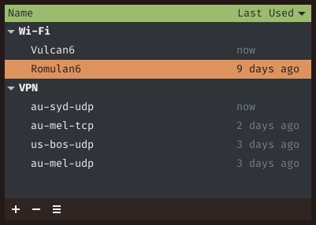

# Debian/RHEL based Users

The `nm-connection-editor` is what you would normally use to auto-start a VPN
on network connect. You would run `nm-connection-editor` in the terminal,
select your network,



Go to the **General** tab, and turn on 'Automatically connect to VPN'. Assuming
you've set up your VPNs, this should be straight forward. And it is for
Fedora and Ubuntu.


# Arch Linux Users

UPDATE: This has been fixed as of 02/03/2021

Now the problem is that `nm-connection-editor` has been crashing on Arch
Linux distros for months whenever you want to auto-start a VPN with a
network connection.

<https://forum.manjaro.org/t/cant-set-vpn-to-start-on-connection-nm-connection-editor-crashes/53689>

Here is a temporary fix using the terminal, it assumes you have
NetworkManager and have already setup the VPN.

First find the UUID of your VPN conneciton

Example

```bash
$ nmcli co

NAME                          UUID                                  TYPE  DEVICE
au-syd-udp                3e8e26ba-f7c0-4311-a657-cd9d4144d097  vpn   wlan0
Vulcan6                       0fe0d044-2fae-4a5a-816c-b2014715c9dd  wifi  wlan0
```

Then set the secondaries option of your wireless device to the UUID of the
VPN. The connection.secondaries option determine secondary networks to
start as the current network is started up. In this case, we want to start
up au-syd-udp

In my case (Vulcan6 is an example)

```bash
$ nmcli co modify Vulcan6 connection.secondaries 3e8e26ba-f7c0-4311-a657-cd9d4144d097
```

Now restart your network connection, and it will autostart the VPN.

```bash
$ nmcli co down Vulcan6
$ nmcli co up Vulcan6
```

To reverse changes,

```bash
$ nmcli co modify Vulcan6 connection.secondaries ""
```

# BE WARNED

`nm-connection-editor` will crash immediately when trying to edit the
device with the secondaries option enabled in Arch Linux. If you want to
edit without CLI, turn off the connection.secondaries and it will work
again.

As I said, this is a temp fix, hope the GUI gets fixed soon.

To see all your options on the CLI

```bash
$ nmcli co show Vulcan6
```

See more at `man nmcli-settings` and `man nmcli-examples`
