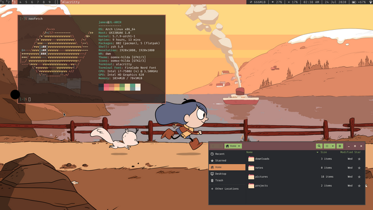

First, an introduction. I am James Lim, Software Student and Linux Lover
residing in the upside down continent that is Australia. Why a blog? To
take notes! And have a public platform I can share. I have always had the
conviction, that when a man or woman finds some Special Gem in their coding
endeavours, it would be especially fun and good to share it.

# For Example...

Did you know Python has offline documentation build in?

The documentation generator pydoc can be used in the command line to quickly get the reference documentation related to a module.

For example, type

```bash
$ pydoc os
```

and you will receive the full documentation of the os module!

```
Help on module os:

NAME
    os - OS routines for NT or Posix depending on what system we're on.

MODULE REFERENCE
    https://docs.python.org/3.9/library/os

    The following documentation is automatically generated from the Python
    source files.  It may be incomplete, incorrect or include features that
    are considered implementation detail and may vary between Python
    implementations.  When in doubt, consult the module reference at the
    location listed above.

DESCRIPTION
    This exports:
      - all functions from posix or nt, e.g. unlink, stat, etc.
      - os.path is either posixpath or ntpath
      - os.name is either 'posix' or 'nt'
      - os.curdir is a string representing the current directory (always '.')
      - os.pardir is a string representing the parent directory (always '..')
      - os.sep is the (or a most common) pathname separator ('/' or '\\')
      
...
```

The cmd not your thing? You can create a local web-server with search function with the documentation.

```bash
$ pydoc -b
```

Opens pydoc in your preferred browser


It may not be pretty, but in a pinch (without wifi) it gets the job done.

# Let us begin!

Stuff like pydoc, Functional Programming, Vim, and especially Linux, are
bits and bobs I crashed into along the way of the Software Engineer, which
I find frightfully useful or especially interesting, and I hope to share
some with you.

All the best dear reader, enjoy the blog!
