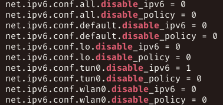

Just a quicky,

P.P.P.S As of 9th June, the results are inconsistent. Sometimes disabling
IPv6 is substantially faster (24 mbps vs 5mbps), sometimes it is about the
same. It seems to be generally faster with it disabled.

P.P.S According to my testing as of 29th May 2021, on kernel
5.12.7-arch1-1, Network speeds are substantially slower when IPv6 is
disabled. Please ignore this article if you are not having performance
issues. According to https://ipv6leak.com/, IPv6 does not seem to leak
either.

P.S Discussion is here

<https://www.reddit.com/r/linux/comments/lw1ko9/disabling_ipv6_for_openvpn_tunnels_can_speed_up/>

All Linux users manually connecting through OpenVPN should know that many
VPN providers don't yet support IPv6 or have it enabled in their
configurations. I encountered this after a couple of days of near native
speeds of 90Mbps to just around 1.5-15Mbps fluctuation.

Many articles such as this one show you how to disable IPv6

<https://protonvpn.com/support/disable-ipv6-protocol-linux/>

The problem is they tend to disable all IPv6 Functionality. While IPv6 is
not yet widely used or supported I do like having the technology enabled
for learning and testing.

And from what I discovered, the only interface that needs IPv6 disabled is
the VPN tunnel itself.

If you run `ip a` in a terminal


You will see the VPN tunnel tun0 which has an IPv6 address
`fe80::7297:2fd6:baaf:6e1d`. This is no good for OpenVPN, so we can simply
disable IPv6 for virtual interface tun0.

P.S as user u/sarcism points out, the above statement is very flawed. I do
agree. It's not that it is no good for OpenVPN, just that it is no good for
the server side configuration used by VPN providers. IPv6 is supported in
OpenVPN, just that many providers are not onto it yet.

The `sysctl` is used to interact with some kernel module parameters at
runtime, in our case, we want to disable IPv6 for tun0.

```bash
$ sudo sysctl net.ipv6.conf.tun0.disable_ipv6=1
```

Now if you test to see if your IPv6 address was removed. Running ip a again
gives me,


And as you can see, the inet6 address has been removed. Then test your
internet speeds, which should improve or at least become more stable.

To make the change permanent on reboot, you need to include the option in
the `/etc/sysctl.conf` file by appending

```
net.ipv6.conf.tun0.disable_ipv6=1
```

to the end of the file.

Knowing how to use `sysctl` is a great boon to runtime testing of kernel
parameters, and saves time from changing the GRUB config or rebooting.

To see all kernel parameters that can be changed, run

```bash
$ sysctl -a
```

To narrow down the selection, run

```bash
$ sysctl -a -r {{ pattern }}
```

Example here

```bash
$ sysctl -a -r ipv6 | grep disabled
```



Be sure to read the man pages and the Arch Wiki for more information!

Happy web surfing!
